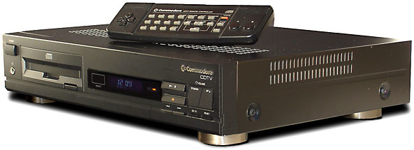
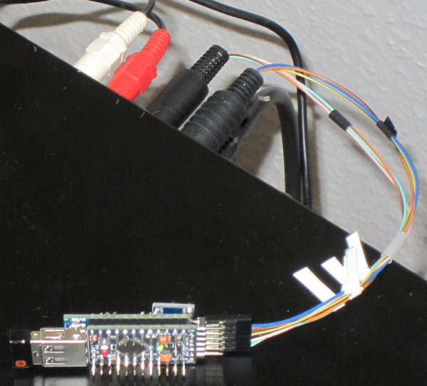

USB2Amiga
=========

This project is about connecting USB HID devices like keyboard, mouse and the
combination of those (sometimes called "desktops") to almost any Amiga. The
project originally started out to get a working keyboard for a Commodore CDTV
without spending big bucks. Also if it should work with a kvm switch that would
be nice.

The project mainly consist of an Arduino Pro Mini clone running at 3.3V / 8MHz
(5V / 16MHz won't work) together with an USB host shield mini (also a clone).
This takes care of reading the USB input. For sending the output, 3.3V are
not enough for a 5V Amiga interface, so a level shifter is needed. (Since the
Amiga is open collector, the project should work without it, it was tested and
working for a couple of hours without any problems. But the ATmega is used way
out of the specification, so a level shifter is highly recommended.)

The code is setup in a modular way, so compiling a version with a different
focus is rather easy. As a result, "big box" Amigas now also supported.

Code Variants
-------------

Name | Keyboard  | Mouse | Comment
-----|-----------|-------|----------------------------------------------------
CDTV | Amiga     | CDTV  | also allows joystick to CDTV conversion
DB9  | Amiga     | Amiga | standard for all big box Amigas
A500 | Amiga 500 | Amiga | A500 uses different keyboard reset implementation
PS2  | PS/2      | Amiga | keyboard output is PS/2 for Kipper 2K's CD32 riser

Systems Tested
--------------

System | Keyboard     | Mouse    | Note
-------|--------------|----------|----------------------------------------
CDTV   | working      | working  | primay development target
CD32   | untested     | working  | riser PS/2 will need different version
A500   | untested     | untested | reset handling differs
A600   | *won't work* | untested | keyboard connected without controller
A1000  | untested     | untested | no system available for testing
A1200  | *won't work* | untested | keyboard connected without controller
A2000  | untested     | untested | soon to come
A3000  | untested     | untested | no system available for testing
A4000  | untested     | untested | no system available for testing
A4000T | working      | working  | tested by "ottifant011" from A1K.org

FAQ
---

* Can I use it with an USB hub? \
  No, sorry. To keep the code simple, this seldom used feature is not
  implmented. The example code for USB keyboard and mouse from the library
  does not support this either, even though the code looks like it might. A
  workaround would be to build two USB2Amiga, using one for keyboard and one
  for mouse.

* Why don't the LEDs (CAPS LOCK, etc.) work? \
  I don't know. They don't work with example code "USBHIDBootKbdAndMouse"
  either, on which this USB code is based on. My guess it's a bug in the USB
  Host Shield library, or maybe it's my cheap USB host shield clone.

* Can I send any CDTV specific codes via keyboard? \
  This is possible also only one keystroke is implemented: the power button.
  This way you can turn the machine one, if it is powered by the 4-pin mini
  DIN connector. Others can be implemented as well, just ask.

* Do I have to install the Arduino IDE just for flashing? \
  No, precompiled hex-files ready for flashing are included in the directory
  name "hex". There is a tool called
  [XLoader](https://www.hobbytronics.co.uk/arduino-xloader) that can upload
  a hex-file as a standalone application. "Duemilanove/Nano(ATmega328)"
  worked for me as the device to upload to. Linux users need the command
  line tool "avrdude" and the search engine of your choice to figure out
  the commandline parameters for the ATmega328 microcontroller used.

* Why can't I compile the project with the Arduino IDE on Windows? \
  The git client you're using is not configured to be using symbolic links.
  I'm using symlinks as a hack to build different variants with an almost
  similar codebase. I had to cope with a bad IDE and a bad OS. A possbile
  solution is described
  [here](https://github.community/t/git-bash-symbolic-links-on-windows/522/4).

Building
--------

- [Commodore CDTV](documentation/Build_CDTV.md)
- ["Big Box" Amigas](documentation/Build_DB9.md)
- [Amiga 500](documentation/Build_A500.md)
- CD32 (tdb)

Acknowledgements
----------------

This project wouldn't have been possible without using and twisting (or at
least looking at) other peoples code.

- USBHIDBootKbdAndMouse example of the
  [USB Host Shield Library 2.0](https://github.com/felis/USB_Host_Shield_2.0)
- [mwd2cdtv](https://github.com/matsstaff/mwd2cdtv) by matsstaff (he used
  [amiga_keyb](https://github.com/hkzlab/AVR-Experiments/tree/master/libs/amiga_keyb)
  code written by hkzlab)
- cssvb94 gave me the idea on how to include support for a standard amiga
  mouse with his project
  [AmigaUSBMouseJoystick](https://github.com/cssvb94/AmigaUSBMouseJoystick)

