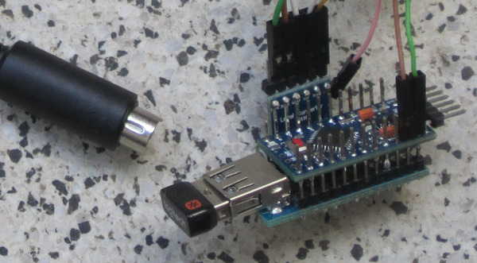

USB2Amiga
=========

This project is about connecting USB HID devices like keyboard, mouse and the
combination of those (sometimes called "desktops") to almost any Amiga. The
project originally started out to get a working keyboard for a Commodore CDTV
without spending big bugs. Also if it should work with a kvm switch that would
be nice.

The project mainly consist of an Arduino Pro Mini clone running at 3.3V / 8MHz
(5V / 16MHz won't work) together with an USB host shield mini (also a clone).
This takes care of reading the USB input. For sending the output, 3.3V are
not enough for a 5V Amiga interface, so a level shifter is needed. (Since the
Amiga is open collector, the project should work without it, it was tested and
working for a couple of hours without any problems. But the ATmega is used way
out of the specification, so a level shifter is highly recommended.)

The code is setup in a modular way, so recompiling with different options set
in `config.h`. So switching from CDTV specific behavior to a generic Amiga
approach is intended (but not yet implemented.)

System | Keyboard   | Mouse    | Joystick | Note
-------|------------|----------|----------|---------------------------------
CDTV   | working    | working  | untested | primay development target
CD32   | untested   | planning | planning | soon to come
A500   | untested   | planning | planning | reset handling different
A600   | won't work | planning | planning | different keyboard handling
A1000  | untested   | planning | planning | no system available for testing
A1200  | won't work | planning | planning | different keyboard handling
A2000  | untested   | planning | planning | soon to come
A3000  | untested   | planning | planning | no system available for testing
A4000  | untested   | planning | planning | no system available for testing
A4000T | untested   | planning | planning | no system available for testing

FAQ
---
Can I use it with an USB hub?

No, sorry. To keep the code simple, this seldom used feature is not implmented.
The example code for USB keyboard and mouse from the library does not support
this either, even though the code looks like it might. A workaround would be to
build two USB2Amiga, using one for keyboard and one for mouse.

Why don't the LEDs (CAPS LOCK, etc.) work?

I don't know. They don't work with example code "USBHIDBootKbdAndMouse" either,
on which this USB code is based on. My guess it's a bug in the USB Host Shield
library, or maybe it's my cheap USB host shield clone.

Building
--------
- [CDTV](Build_CDTV.md)

Acknowledgements
----------------
This project wouldn't have been possible without using and twisting (or at
least looking at) other peoples code.

- USBHIDBootKbdAndMouse example of the
  [USB Host Shield Library 2.0](https://github.com/felis/USB_Host_Shield_2.0)
- [mwd2cdtv](https://github.com/matsstaff/mwd2cdtv) by matsstaff (he used
  [amiga_keyb](https://github.com/hkzlab/AVR-Experiments/tree/master/libs/amiga_keyb)
  code written by hkzlab)
- cssvb94 gave me the idea on how to include support for a standard amiga
  mouse with his project
  [AmigaUSBMouseJoystick](https://github.com/cssvb94/AmigaUSBMouseJoystick)
