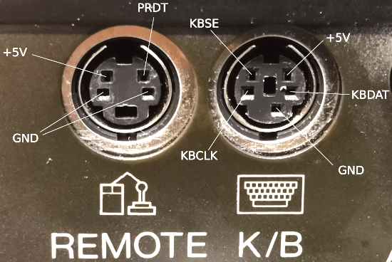

Build Configuration For CDTV
============================

You can use the precompiled file `hex/USB2Amiga.CDTV.hex` to program the
Arduino pro mini 328p 3.3V.

Pins On Arduino
---------------

Pin | Signal    | Note
----|-----------|-------------------------------------
 2  | KBCLK     |
 3  | KBDAT     | may not be changed
 6  | PRDT      |
 A0 | DB9 Pin 4 | optional joystick to CDTV interface
 A1 | DB9 Pin 3 | optional joystick to CDTV interface
 A2 | DB9 Pin 2 | optional joystick to CDTV interface
 A3 | DB9 Pin 1 | optional joystick to CDTV interface
 A4 | DB9 Pin 9 | optional joystick to CDTV interface
 A5 | DB9 Pin 6 | optional joystick to CDTV interface
GND | DB9 Pin 8 | optional joystick to CDTV interface

[(Is the mentioned level shifter necessary?)](LevelShifter.md)

Pull the non-joystick signals through a level shifter with LV# on Arduino
side and HV# on CDTV side. The pins 2, 3 and 6 match the layout of the
typical 4-bit level shifters, where the pins in the center are used for GND
and refence voltage. The joystick interface is purely passive, so there is
no need for level shifting. This also means that the CD32 gamepad will not
work properly.

Also connect +5V from only one of the ports to RAW on the Arduino Pro Mini
and HV on the level shifter. The +5V from the 5-pin connector (labeled "K/B")
is switched off when the unit goes to standby, the +5V from the 4-pin
connector (labeled "Remote") is always on. **So don't short these two.** LV
of the level shifter is connected to 3.3V (VCC) on the Arduino.

GND should be connected to both CDTV ports, GND on both sides of the level
shifter and GND on the Arduino. This way the converter works also when only
one port is connected for that port.

Pins On CDTV
------------

