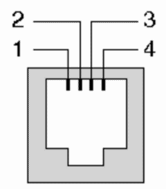
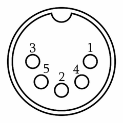
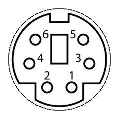

Build Configuration For Big Box Amigas
======================================

You can use the precompiled file `hex/USB2Amiga.DB9.hex` to program the
Arduino pro mini 328p 3.3V.

Pins On Arduino
---------------

Pin | Signal    | Note
----|-----------|------------------------------
 2  | KBCLK     |
 3  | KBDAT     | may not be changed
 4  | DB9 Pin 1 | Y2 mouse signal
 5  | DB9 Pin 2 | X1 mouse signal
 6  | DB9 Pin 3 | Y1 mouse signal
 7  | DB9 Pin 4 | X2 mouse signal
 8  | DB9 Pin 6 | left mouse button
A0  | DB9 Pin 9 | right mouse button
A1  | DB9 Pin 5 | optional middle mouse button
GND | DB9 Pin 8 | mouse ground

[(Is the mentioned level shifter necessary?)](LevelShifter.md)

Pull these signals through a level shifter with LV# on the Arduino side and
HV# on the Amiga side. With an 8-bit level shifter you can get everything
working, if you skip the optional middle mouse button.

Connect all GNDs together: the GND of the keyboard connector, pin 8 of the
DB9 mouse connector, the Arduino pro mini and both sides of the level shifter.
There are level shifter that only have one GND and an extra connector called
"OE". According to
[this discussion](https://forum.arduino.cc/index.php?topic=406261.0)
this needs to be connected to +5V using a 1k Ohm pull-up resistor. +5V needs
to be connected to HV of the level shifter, RAW of the Arduino pro mini and
the +5V pin of the keyboard connector. The +5V of the DB9 mouse connector
can be skipped, since we are getting power from the keyboard connector
already.

The DB9 pins are described above, the pins of the keyboard connector differ
from model to model.

A1000
-----

The connector is called 4P4C or RJ10.

Pin | Function
----|----------
 1  | +5V
 2  | KBCLK
 3  | KBDAT
 4  | GND

A2000 & A3000
-------------

Note the odd numbering of the pins.

Pin | Function
----|----------
 1  | KBCLK
 2  | KBDAT
 3  | n/c
 4  | GND
 5  | +5V

A4000
-----

The connector physically the same as the PS/2 keyboard connector. This means
you can reuse and old PS/2 keyboard or mouse cable.

Pin | Function
----|----------
 1  | KBDAT
 2  | n/c
 3  | GND
 4  | +5V
 5  | KBCLK
 6  | n/c

Also note that all connectors show the Amiga connector side, not the cable
connector.
